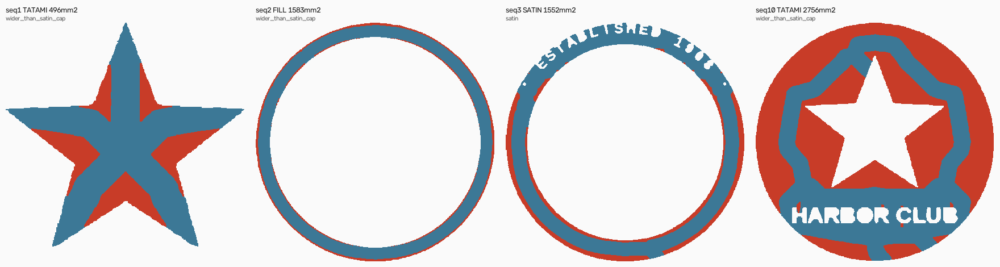

# The classification smell — mechanism, before any fix

**Your question was: is the medial-axis width test admitting a region it shouldn't, or is the region
itself wrong upstream in segmentation? The answer is neither, and the object has no single correct
answer.**

Badge Satin 3 is **one genuinely connected ring band that is two different shapes along its length**:
a plain 7 mm band over half its circumference, and 2–3 mm letter-gap slivers over the other half,
where `ESTABLISHED 19XX` is knocked out of it. It is correctly segmented. The width cap is correctly
set. What fails is that a **single scalar median cannot describe a shape like that** — and the way
the median is taken makes it report the wrong half.

I also have to correct my own report. **"11 disconnected tatami islands" was wrong.** They are not
islands. They are three arcs of a single boundary rind, cut into pieces by the lettering, plus eight
sub-millimetre slivers. That framing sent both of us at a segmentation hypothesis that the
measurements do not support, and it was my characterisation, not yours.

---

## 1. The region is correct

| | |
|---|---|
| Satin 3 | 1,551.9 mm², **one** connected component, contour 1,080 pts, 3 holes |
| what it is | the inner navy ring carrying the arc lettering |

One component, one ring, one colour. There is nothing for segmentation to have got wrong: this is a
ring band, and a ring band is one object.

## 2. The two tests both pass, and both are looking at the right thing

```
region_median_w 2.89   skeleton_median_w 3.62   uncovered 0.246   ->  SATIN
                                        cap 4.50             cap 0.350
```

Neither is a near miss on a badly-set constant. `SATIN_MAX_W_MM = 4.5` is right for satin. The
problem is upstream of both: **the 3.62 mm is not this band's width.**

## 3. The band is 6.98 mm wide, and 96.7% of it is over the cap

Measured straight off the region, no axis involved — radial extent per 1° sector:

| | p10 | p50 | p90 | max | over the 4.5 mm cap |
|---|---:|---:|---:|---:|---:|
| **Satin 3** (lettered ring) | 6.84 | **6.98** | 7.05 | 7.16 | **96.7% of the circumference** |
| Fill 2 (plain ring) | 5.45 | 5.51 | 5.56 | 5.72 | 100.0% |

So the classifier read **3.62 mm for a band that is 6.98 mm wide** — under by 1.9×.

**Fill 2 is the natural control, and it is the strongest evidence in this report.** Same design, same
raster, concentric with it, the same shape family, one connected ring — and *no lettering*. Its
skeleton median reads **5.26 mm against a true 5.51 mm, accurate to 5%**, so it is correctly rejected
as too wide and comes out a fill. The statistic works perfectly on the ring without text and fails by
almost 2× on the ring with text. That isolates the cause to the lettering.

## 4. Why: the median is taken over axis SAMPLES, and sample density is not uniform

`_axis_samples` walks every medial-axis branch, decimates it at the column pitch, and appends one
width per station. `median_w` is then `np.median(widths)`. **That weights each sample equally, so it
weights each unit of AXIS LENGTH equally — not each unit of the shape.**

Knocking letters out of a band multiplies the axis length in that arc: instead of one strand down the
band's centre, you get a strand threading above and below every letter, plus a stub into every
counter. Same arc of the ring, several times the axis.

Per 30° sector — 0° is 3 o'clock, growing clockwise:

| sector | samples | median width | share under the cap |
|---|---:|---:|---:|
| 0–30 | 45 | 6.39 mm | 0.0% |
| 30–60 | 38 | 6.98 mm | 0.0% |
| 60–90 | 81 | 6.24 mm | 16.0% |
| 90–120 | 44 | 6.23 mm | 0.0% |
| 120–150 | 38 | 6.97 mm | 0.0% |
| 150–180 | 45 | 6.54 mm | 0.0% |
| 180–210 | 118 | 5.57 mm | 32.2% |
| **210–240** | **222** | **2.41 mm** | **92.8%** |
| **240–270** | **193** | **2.73 mm** | **100.0%** |
| **270–300** | **210** | **3.08 mm** | **88.6%** |
| **300–330** | **212** | **2.53 mm** | **91.0%** |
| 330–360 | 58 | 6.04 mm | 8.6% |

The lettered arc is **~42% of the circumference but carries 66% of the axis samples** — 2.4× the
sampling density of the plain arc, exactly as fragmentation predicts. It therefore wins the vote.

The width histogram is openly **bimodal**, and the median lands in the trough between the two modes:

```
 0.0-1.0mm   123   9.4%  #####
 1.0-2.0mm   191  14.6%  ########
 2.0-3.0mm   208  16.0%  #########      <- letter-gap slivers
 3.0-4.0mm   234  17.9%  ##########        median 3.62 sits HERE
 4.0-4.5mm    78   6.0%  ###
 4.5-5.0mm    38   2.9%  #
 5.0-6.0mm   119   9.1%  #####
 6.0-7.0mm   278  21.3%  ############   <- the actual band
 7.0-8.0mm    35   2.7%  #
```

A median is the right summary for a stroke of roughly constant width. **This shape has two widths,
and there is no scalar that is honest about it.**

### The area check

The sub-cap samples are 64% of the vote but only **41% of the band's area**. Weighting each sample by
the strip it stands for gives a mean width of **4.92 mm** — over the cap, so an area-weighted
statistic would have rejected this object. I am recording that as a diagnostic, **not proposing it as
the fix** (see §6).



*Left to right: the star (tatami), the plain outer ring (fill), the lettered ring (satin — this
object), and the field with `HARBOR CLUB` (tatami). Red is `wide_mask`. On both rings it is a rind
along the edges, never the middle.*

## 5. What the uncovered mask actually is

Not islands. Bucketing every uncovered pixel by where it sits across the band:

| | inner third | middle third | outer third |
|---|---:|---:|---:|
| Satin 3 | 36.7% | **0.0%** | 63.3% |
| Fill 2 | 27.3% | **0.0%** | 72.7% |

**Zero pixels in the middle.** It is a rind hugging both edges of the band — precisely what capping a
column at 4.5 mm on a 6.98 mm band must leave over. Predicted leftover from the cap alone is
542 mm² against 382 mm² actually uncovered, same order; on Fill 2 it is 284 predicted vs 273 actual,
a 0.96× match. The rind is arithmetic, not a defect.

The "11 components" are that rind chopped up by the letters: three arcs of 139.4, 126.0 and
102.4 mm² — 368 of the 382 mm² — plus eight slivers of 10.8 mm² and below.

## 6. Two hypotheses I refuted on the way

**`_extend_branch_ends` poisoning the statistic.** `_axis_samples` collects widths *after* extending
each branch past the axis toward the stroke cap, where the distance transform tends to zero. Those
extensions are 28% of Satin 3's samples, so this looked strong. Measured: median **3.62 mm with them,
3.71 mm without**. A 0.09 mm move against the 3.3 mm needed. **Refuted.**

**`SATIN_MAX_UNCOVERED` being a blind scalar share.** My first reading was that 0.246 passes because a
share cannot tell a thin rind from fat lumps. Measured: it *is* a thin rind (§5), and the share is
reporting it accurately. The reducibility test is not the thing that is broken. **Refuted.**

I also mis-sampled the axis into the wrong coordinate frame on the first attempt — the axis comes back
in hi-res coordinates — which produced a nonsense `p50 0.00 mm`. Caught it because a medial axis
cannot have zero width by construction, and re-measured off the region instead.

---

## 7. What I recommend, and what I have NOT done

**No code changed.** Reporting the mechanism first, as instructed.

The finding argues against a statistic tweak. An area-weighted width would flip this object to a fill
— but then the whole ring is tatami'd, **including the 2–3 mm letter-gap slivers that genuinely are
satin**, and those are the parts a digitizer would most want columned. A sample-count median gets the
plain arc wrong; an area-weighted mean gets the lettered arc wrong. Both are single scalars applied to
a shape that has two answers.

**The unit is wrong, not the threshold.** The band should be split at the width transition — plain arc
one way, lettered arc the other — and then each piece classified on its own. That is a real change to
what an "object" is, it touches segmentation, the object model, `params_hash` provenance and B2's
transforms, and it should not be started on my say-so.

Three options, in my order of preference:

1. **Split regions at width discontinuities before classifying.** Correct, and it generalises — any
   badge, seal or ribbon with text knocked out of a band has this shape. Largest blast radius.
2. **Let one object carry a per-branch decision** — satin on branches under the cap, fill on branches
   over it — instead of one verdict per object. Smaller change, keeps the object model intact, but
   makes `stitch_type` a lie at the object level and the Studio shows `stitch_type` to the user.
3. **Leave it.** The current output is not broken: coverage is 100% and the badge is 22.65 min. This
   object costs ~155 travel stitches and five over-20 mm jumps. On the corpus as it stands, the prize
   is small.

I lean 1, but I would want to measure how many of the ten fixtures have a bimodal-width object at all
before spending that. **Say which, and whether you want that survey first.**

Meanwhile 1c is unblocked and I will take it next unless you redirect.

**5c stays open and unabsorbed** — nothing here touches the +6 trim divergence, and nothing here
explains it.
